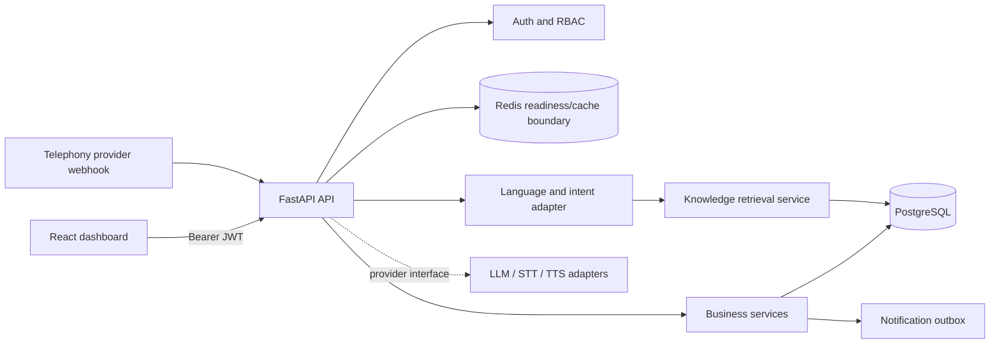

# CareConnect

A multi-tenant clinic operations workspace with patient management, appointment booking, call records, knowledge-backed answers, and an AI-receptionist test console. The API is FastAPI/SQLAlchemy; the admin app is React, TypeScript, Vite, Tailwind, and TanStack Query.

> This is a working development foundation, not a production voice-AI deployment. The local assistant uses rules and saved clinic knowledge; it does not call an LLM or place phone calls. See [known limitations](docs/troubleshooting.md#known-limitations).

## Features

- Business-owner registration, Argon2 password hashing, JWT access tokens, rotating refresh tokens, logout, and server-side role checks.
- Business profile, timezone, opening hours, and holidays.
- Tenant-scoped customers and history, leads, follow-ups, staff, doctors, services, knowledge documents, calls, and escalations.
- Availability lookup and transactional booking with unique five-minute reservation rows to reject overlapping appointments.
- Appointment cancellation/rescheduling and a notification outbox for confirmation, cancellation, and reschedule events.
- Tamil, English, and Tanglish rule-based language/intent detection; knowledge answers only return saved text, otherwise the assistant offers human handoff.
- Request IDs, structured request logs, CORS, security headers, API rate limiting, and readiness probes.
- Responsive React dashboard with search, empty/loading/error states, clinic settings, operational forms, a call transcript view, and an assistant test console.

## Architecture



## Repository layout

```text
backend/      FastAPI application, SQLAlchemy models, services, migrations, tests
frontend/     React/Vite dashboard, API client, component tests, Nginx container
backend/app/api/       Auth, business, operations, knowledge, calls/AI routes
backend/app/ai/        Language intent and replaceable provider interfaces
backend/app/services/  Appointment, RAG, and notification services
docs/         Architecture, database, API, security, AI, voice, deployment, tests
.github/      CI workflow
docker-compose.yml      PostgreSQL, Redis, API, Nginx frontend
```

## Local setup (Windows PowerShell)

Python 3.13+, Node.js 22+, and npm are required.

1. Start the API in one terminal:

```powershell
python -m venv backend/.venv
backend/.venv/Scripts/python.exe -m pip install -r backend/requirements.txt
Push-Location backend
.\.venv\Scripts\python.exe -m uvicorn app.main:app --reload --port 8000
```

The API defaults to a local SQLite database for development and creates its tables on startup. The frontend proxies `/api` to `localhost:8000`.

2. Start the dashboard in a second terminal:

```powershell
Push-Location frontend
npm ci
npm run dev -- --host 0.0.0.0
```

Open <http://localhost:5173>. Create the first clinic owner account on the sign-in screen. API health is at <http://localhost:8000/health>; interactive API docs are at <http://localhost:8000/docs>.

## Docker Compose

Copy the sample environment file, then start Docker Desktop before running Compose:

```powershell
Copy-Item .env.example .env
# Change the development-only secrets before any shared deployment.
docker compose up --build
```

Open <http://localhost:8080>. `docker compose down` stops containers; named volumes retain data. `docker compose down -v` deletes the local database and Redis volumes.

## Environment variables

See [.env.example](.env.example). `SECRET_KEY` must be unique and secret in production. PostgreSQL credentials in the sample are local-only. `VOICE_WEBHOOK_SECRET` enables the shared-secret voice webhook; keep it unset until a provider is configured. Never commit `.env`.

## Database migrations

```powershell
Push-Location backend
$env:DATABASE_URL = "sqlite:///./careconnect.db" # or set a PostgreSQL URL
.\.venv\Scripts\alembic.exe upgrade head
```

Development startup creates missing tables for convenience. Production mode skips automatic schema creation and requires applying migrations before starting the API.

## Tests and builds

```powershell
Push-Location backend
.\.venv\Scripts\python.exe -m pytest -q
Pop-Location
Push-Location frontend
npm test -- --run
npm run lint
npm run build
```

## API overview

API prefix: `/api/v1`. The complete route list and request patterns are in [docs/api.md](docs/api.md). Authentication uses `Authorization: Bearer <access_token>`.

## Security and deployment

Tenant IDs are taken from the authenticated server-side user record, never from client-supplied ownership fields. SQLAlchemy parameterizes queries. Local rate limiting is process-memory based; use an ingress/shared limiter for multi-worker production. The production checklist and deployment steps are in [docs/deployment.md](docs/deployment.md).

## Demo workflow

1. Register a clinic owner.
2. Add a doctor and a service, then add a patient.
3. Open Appointments, select patient/provider/service/date, choose an API-returned available slot, and confirm.
4. Open Knowledge base and save an approved FAQ. Ask the AI assistant about it in Tamil, English, or Tanglish.
5. Unknown questions receive the staff handoff response. Call webhooks remain disabled until `VOICE_WEBHOOK_SECRET` and an actual telephony adapter are configured.

## Current boundaries

This codebase covers the foundation and core CRUD/scheduling/admin slices, but is not yet a production-complete SaaS. See [docs/ai-agent.md](docs/ai-agent.md), [docs/voice-flow.md](docs/voice-flow.md), [docs/rag.md](docs/rag.md), and [docs/troubleshooting.md](docs/troubleshooting.md) for exact adapter, delivery, vector-search, and authorization limitations.
