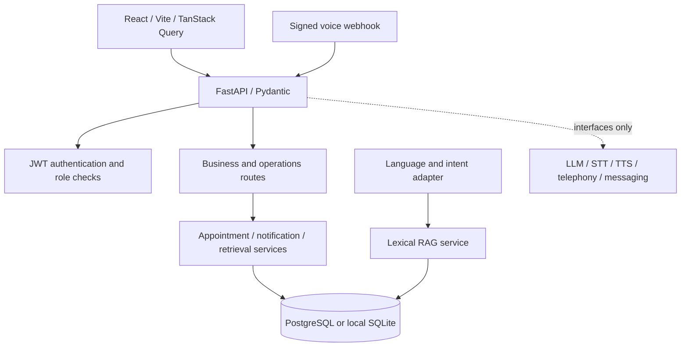

# Architecture

CareConnect is a modular monolith: the browser calls a versioned FastAPI API; API route groups validate inputs and authenticate the caller; SQLAlchemy services and tenant-filtered queries perform business operations. PostgreSQL is the Compose database. SQLite is the zero-setup local-development default. Redis is provisioned in Compose and checked by readiness; a shared cache/rate-limit implementation is not yet enabled.

## Trust boundaries

- The browser stores access and refresh tokens and does not choose a business ID for API operations.
- The API resolves the user from the signed access token, then uses `user.business_id` for data scope.
- Appointment reservation rows enforce non-overlap using a database unique constraint on doctor and five-minute UTC interval.
- Voice webhooks require a configured shared secret and a business ID inside the authenticated provider payload.
- Provider interfaces are contracts only until a vendor is configured and integration tests are added.

## Runtime modes

- Local: Vite on port 5173, FastAPI on port 8000, SQLite under `backend/`.
- Compose: Nginx frontend on 8080, FastAPI on 8000, PostgreSQL on 5432 (not published), Redis on the internal network.
- Production: provide managed PostgreSQL/Redis, TLS ingress, external secrets, migrations, and provider adapters; do not use the sample secrets or in-memory rate limiter.
