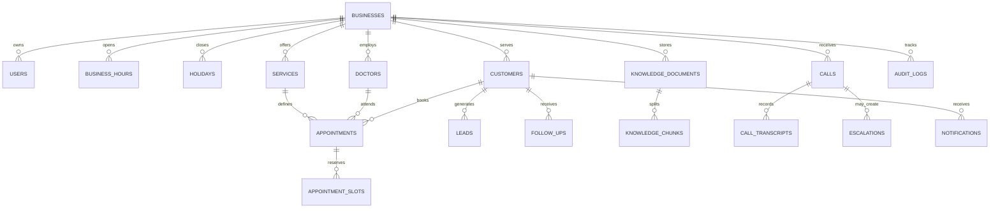

# Database

SQLAlchemy models are defined in `backend/app/models.py`. Every clinic-owned operational record contains `business_id`; routes scope reads and writes from the authenticated user. Foreign keys connect operational history to customers and providers.

## Important constraints

- User email is unique globally.
- Customer phone is unique within a business.
- Business weekday hours and holiday dates are unique per business.
- An active appointment reserves each five-minute interval from `starts_at` up to (but not including) `ends_at`; `(doctor_id, slot_at)` is unique. Cancellation deletes reservations; rescheduling replaces them in a transaction.
- Stored appointment times are normalized to UTC; availability windows are built in the configured business timezone.

## Migration notes

`backend/alembic/versions/0001_initial.py` creates the initial metadata baseline. Development startup can create missing tables automatically. Production skips that behavior and should use `alembic upgrade head`. Future schema changes should use generated, explicit Alembic revisions; do not edit an applied baseline.
